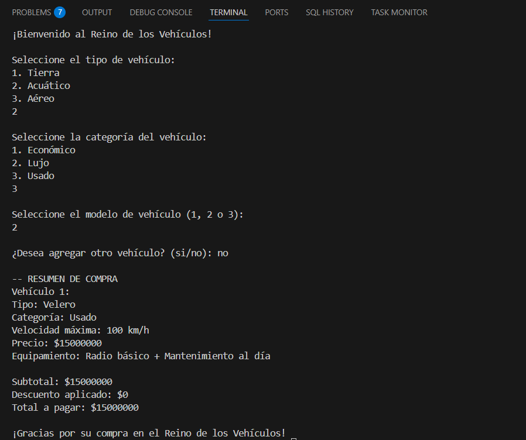

# DOSW-Bootcamp-Laboratorio-02

## Integrantes
-Gina Sofia Garcia
-Juan Diego Patiño

---

## Retos completados

---

### Reto 1: El problema de la tienda de Don Pepe

**Evidencia:**

**Descripción:**
El reto de la tienda de Don Pepe consiste en crear un sistema de ventas sencillo donde se agregue productos a un carrito de compras, recibaun descuento segun el tipo de cliente y que obtenga un recibo al finalizar la compra pero el recibo debe mostrar ciertas especificaciones. 
Ahora para entender mas se realizaron las siguientes aplicaciones en el codigo para poder llevarlo de una manera limpia y organizada cumpliendo los requisitos del reto.

### Encapsulamiento
Hemos protegido la integridad de los datos utilizando:
Atributos Privados: Los datos de Producto y Cliente no pueden ser modificados desde fuera de la clase.
Inmutabilidad: Uso de la palabra clave final para asegurar que el precio y el nombre no cambien una vez creados.
Métodos Getter: Solo permitimos la lectura controlada de la información necesaria.

### Polimorfismo
Se aplica mediante el Patrón Strategy en la gestión de descuentos:
Tratamos a ClienteNuevo y ClienteFrecuente como un objeto genérico de tipo Cliente.
El sistama decide en tiempo de ejecución qué lógica de descuento aplicar (5% o 10%) sin necesidad de usar condicionales if/else complejos.

### Aplicación de los principios SOLID:

### S – Single Responsibility Principle: 
Cada clase tiene un solo motivo para cambiar (ej. Carrito solo gestiona la lista de items).

### O – Open/Closed Principle
Podemos agregar nuevos tipos de descuento (ej. VIP) creando una nueva clase sin tocar el código existente.

### L – Liskov Substitution Principle
Cualquier subclase de Cliente puede ser usada por el Carrito sin alterar su funcionamiento.

### I – Interface Segregation Principle (Segregación de Interfaces)
Las clases son pequeñas y específicas, evitando métodos innecesarios.

### D – Dependency Inversion Principle
El Carrito depende de la abstracción Cliente, no de una implementación específica.

### Reto 2: El chef de 5 estrellas

**Evidencia:**

**Descripción:**

### - Categoría:

### - Patrón:

### - Justificación:

### - Como se aplico:

### Reto 3: El Reino de los Vehiculos

**Evidencia:**

**Descripción:**
Descripción del Reto #3: El Reino de los Vehículos 
Este desafío consiste en diseñar e implementar un sistema para una concesionaria multimodelo capaz de gestionar la venta de diversos medios de transporte (terrestres, acuáticos y aéreos) bajo diferentes estándares de calidad.

El sistema debe permitir:

Gestión de Familias de Productos: Capacidad para manejar vehículos de distintas naturalezas como Autos, Bicicletas y Motos (Tierra); Lanchas, Veleros y Jet Skis (Mar); y Aviones, Avionetas o Helicópteros (Aire).

Segmentación por Categorías: Cada vehículo debe pertenecer a una categoría específica (Económico, Lujo o Usado), la cual altera dinámicamente sus atributos técnicos y comerciales (velocidad máxima, precio y equipamiento).

Compra Múltiple: Los usuarios pueden seleccionar una cantidad indefinida de vehículos con diferentes especificaciones en una sola sesión de compra.

**Patrón de Diseño:** 
Creacional 

**Patrón Utilizado:**
Factory Method (Fábrica)

**Justificación:**
Se utilizó este patrón para centralizar la creación de los diferentes tipos de vehículos en una sola clase (VehiculoFactory). Esto evita que el código cliente tenga que conocer las clases específicas de cada vehículo y categoría, permitiendo que el sistema sea escalable (podríamos añadir "Vehículos Espaciales" mañana sin cambiar la lógica de compra).

**Cómo lo aplico:** 
Se creó una interfaz/clase abstracta Vehiculo y una fábrica que, mediante parámetros de tipo y categoría, instancia el objeto correcto. Al final, se procesa la lista de objetos creados mediante un Stream para consolidar el precio total.
---

### Reto 4: La Estafa de la Casa de Cambio

**Evidencia:**
**Descripción:**

---

### Reto 5: El Café Personalizado

**Evidencia:**
**Descripción:**

---

### Reto 6: Habla con Soporte Técnico

**Evidencia:**
**Descripción:**

---

### Reto 7: El Control Remoto Mágico

**Evidencia:**

**Descripción:**

### Categoría del patrón de diseño

### Patrón Utilizado

### Justificación

### ¿Cómo lo aplicó?

---